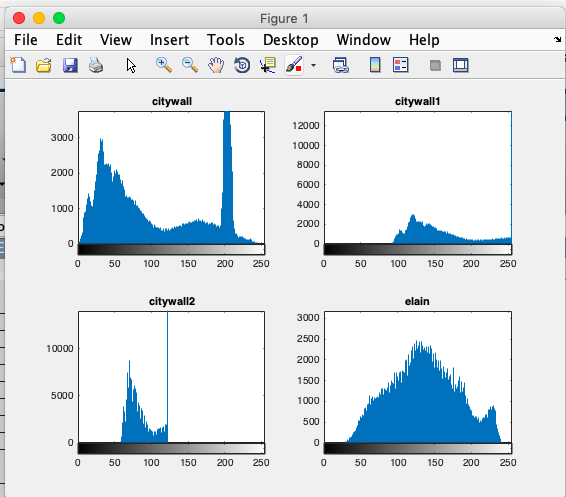

# 数字图像处理第三次作业
### 自动化63
### 杨卓
### 2160504078  
**1.把附件图像的直方图画出；**  

1. 问题分析  
	对一幅图像从上到下，从左到右扫描每个像素值，在每个灰度值上计算像素数目，以这些为基础完成图像直方图的绘制。
2. matlab函数  
	先用imread读出图像，用ind2gray取消其调色板。  
	[f1,map]=imread('citywall.bmp');i1=ind2gray(f1,map);  
	将原始图像i的直方图变成用户指定向量hgram。  
	j=histeq（i，n）  
	指定直方图均衡化后的灰度级数n。
3. 处理结果
  
 

4. 结果分析  
	可以看出尽管图像的图形形状相同，但在不同亮度下其直方图完全不同：的在暗图像中，直方图的分量集中在灰度级的低端；亮图像的直方图分量则倾向于灰度级的高端。对比度地的图像具有较窄的直方图，且集中于灰度级的中部；高对比度图像中直方图的分量覆盖了很宽的灰度级范围，且像素分配不均匀。
5. 代码实现
	[f1,map]= imread('citywall.bmp');i1=ind2gray(f1,map);
	[f2,map1]= imread('citywall1.bmp');i2=ind2gray(f2,map1);
	[f3,map3]= imread('citywall2.bmp');i3=ind2gray(f3,map3);
	[f4,map4]= imread('elain.bmp');i4=ind2gray(f4,map4);
	figure(1)
	subplot(221),imhist(i1),title('citywall');
	subplot(222),imhist(i2),title('citywall1');
	subplot(223),imhist(i3),title('citywall2');
	subplot(224),imhist(i4),title('elain');
	
	[f5,map5]= imread('elain1.bmp');i5=ind2gray(f5,map5);
	[f6,map6]= imread('elain2.bmp');i6=ind2gray(f6,map6);
	[f7,map7]= imread('elain3.bmp');i7=ind2gray(f7,map7);
	[f8,map8]= imread('lena.bmp');i8=ind2gray(f8,map8);
	figure(2)
	subplot(221),imhist(i5),title('elain1');
	subplot(222),imhist(i6),title('elain2');
	subplot(223),imhist(i7),title('elain3');
	subplot(224),imhist(i8),title('lena')
	
	[f9,map9]= imread('lena1.bmp'); i9=ind2gray(f9,map9);
	[f10,map10]= imread('lena2.bmp');i10=ind2gray(f10,map10);
	[f11,map11]=imread('lena4.bmp');i11=ind2gray(f11,map11);
	[f12,map12]= imread('woman.bmp'); i12=ind2gray(f12,map12);
	figure(3)
	subplot(221),imhist(i9),title('lean1');
	subplot(222),imhist(i10),title('lena2');
	subplot(223),imhist(i11),title('lena4');
	subplot(224),imhist(i12),title('woman');
	
	[f13,map13]=imread('woman1.bmp');i13=ind2gray(f13,map13);
	[f14,map14]=imread('woman2.bmp');i14= ind2gray(f14,map14);
	figure(4)
	subplot(221),imhist(i13),title('women1');
	subplot(222),imhist(i14),title('women2');

**2.把所有图像进行直方图均衡；输出均衡后的图像和源图像进行比对；**
1. 问题分析  
	直方图均衡就是对图像进行非线性拉伸，重新分配图像像素值，使一定灰度范围内的像素数量大致相同。直方图均衡化就是把给定直方图像的直方图分布改变成“均匀”分布直方图。
2. matlab函数  
	利用matlab自带的语句：g=histeq（f，256）直接求出图像f的均衡直方图g
3. 处理结果

4. 结果分析  
	从原图像与均衡后的图像对比可以发现后者在视觉上的效果更好，原因在于增强了图片的对比度，将原本过亮或者过暗的图片进行了平均，对比度地的图像具有较窄的直方图，且集中于灰度级的中部；高对比度图像中直方图的分量覆盖了很宽的灰度级范围，且像素分配不均匀。
5. 代码实现
	g1=histeq(i1,256);
	g2=histeq(i2,256);
	figure(1)
	subplot(221),imshow(i1),title('citywall');
	subplot(222),imshow(g1),title('balanced');
	subplot(223),imshow(i2),title('citywall1');
	subplot(224),imshow(g2),title('balanced');
	
	g3=histeq(i3,256);
	g4=histeq(i4,256);
	figure(2)
	subplot(221),imshow(i3),title('citywall2');
	subplot(222),imshow(g3),title('balanced');
	subplot(223),imshow(i4),title('elain');
	subplot(224),imshow(g4),title('balanced');
	
	g5=histeq(i5,256);
	g6=histeq(i6,256);
	figure(3)
	subplot(221),imshow(i5),title('elain1');
	subplot(222),imshow(g5),title('balanced');
	subplot(223),imshow(i6),title('elain2');
	subplot(224),imshow(g6),title('balanced');
	
	g7=histeq(i7,256);
	g8=histeq(i8,256);
	figure(4)
	subplot(221),imshow(i7),title('elain3');
	subplot(222),imshow(g7),title('balanced');
	subplot(223),imshow(i8),title('lena');
	subplot(224),imshow(g8),title('balanced');
	
	g9 =histeq(i9,256);
	g10=histeq(i10,256);
	figure(5)
	subplot(221),imshow(i9),title('lena1');
	subplot(222),imshow(g9),title('balanced');
	subplot(223),imshow(i10),title('lena2');
	subplot(224),imshow(g10),title('balanced');
	
	g11=histeq(i11,256);
	g12=histeq(i12,256);
	figure(6)
	subplot(221),imshow(i11),title('lena4');
	subplot(222),imshow(g11),title('balanced');
	subplot(223),imshow(i12),title('woman');
	subplot(224),imshow(g12),title('balanced');
	
	g13=histeq(i13,256);
	g14=histeq(i14,256);
	figure(7)
	subplot(221),imshow(i13),title('woman1');
	subplot(222),imshow(g13),title('balanced');
	subplot(223),imshow(i14),title('woman2');
	subplot(224),imshow(g14),title('balanced');
**3.进一步把图像按照对源图像直方图的观察，各自自行指定不同源图像的直方图，进行直方图匹配，进行图像增强；**
1. 问题分析：  
	 将图像直方图以标准图像的直方图为标准作变换的直方图相同和近似，从而使两幅图像具有相同的归一化的均匀直方图。  
	先写了一个直方图匹配的函数histmatching，在这个函数中，我们定义了两个输入、两个输出[image\_out,out]=histmatching(image\_in,hist)
	1. 第一步求解a1，即输入图像image\_in的直方图；
	2. 第二步求解a2，求解出模板直方图均衡化用到的变换向量；
	3. 第三步为输入图像匹配模板直方图用到的变换向量；
	4. 最后直接用该函数直接求解   
2. matlab实现

3. 结果分析  
	对比原始图像及增强后的图像可知，经过直方图后，大部分图像的效果得到了一定改善。但也注意到有些图像的效果变差了，可能是因为要求匹配的图选择不合适或是要求进行直方图匹配的图像的直方图灰度值分布过于集中。
4. 代码实现  
	%histmatching函数
	function [image_out, out] = histmatching(image_in, hist)
	Level = 256;
	[m, n] = size(image_in);
	image_hist = imhist(image_in);
	image_out = image_in;
	ac1 = zeros(Level, 1);
	a1 = zeros(Level, 1, 'uint8');
	ac1(1) = image_hist(1);
	for i = 2 : Level
	ac1(i) = ac1(i - 1) + image_hist(i);
	end
	ac1 = ac1 * (Level - 1);
	for i = 1 : 256
	    a1(i) = uint8(round((ac1(i)) / (m * n)));
	end
	ac2 = zeros(Level, 1);
	a2 = zeros(Level, 1, 'uint8');
	ac2(1) = hist(1);
	for i = 2 : Level
	    ac2(i) = ac2(i - 1) + hist(i);
	end
	ac2 = ac2 * (Level - 1);
	hist_sum = sum(hist);
	for i = 1 : 256
	    a2(i) = uint8(round((ac2(i)) / hist_sum));
	end
	temp = zeros(Level, 1, 'uint8');
	out = a1;
	for i = 1 : 256
	    for j = 1 : 256
	        temp(j) = abs(a1(i) - a2(j));
	    end
	    [~, B] = min(temp);
	    out(i) = B - 1;
	end
	for i = 1 : m
	    for j = 1 : n
	        image_out(i, j) = out(uint32(image_in(i, j)) + 1);
	    end
	end
	end
---- 
	j1=imhist(i1);
	j2=imhist(i4);
	j3=imhist(i8);
	j4=imhist(i12);
	
	[match2,Q2]=histmatching(i2,j1);
	figure(1)
	subplot(121),imshow(i1);title('citywall')
	subplot(122),imhist(i1),title('Histogram')
	figure(2)
	subplot(221),imshow(i2),title('citywall1');
	subplot(222),imshow(match2),title('Histogram')
	subplot(223),imhist(i2);
	subplot(224),imhist(match2);
	
	[match3,Q3]=histmatching(i3,j1);
	figure(3)
	subplot(221),imshow(i3),title('citywall2');
	subplot(222),imshow(match3),title('Histogram')
	subplot(223),imhist(i3);
	subplot(224),imhist(match3)
**4.对elain和lena图像进行7\*7的局部直方图增强**
1. 问题分析  
	利用图像的局部区域，如局部均值，方差。梯度获取不同区域的差异情况，从而对图像不同区域进行不同的增值。常用直方图变化。
2. matlab实现  
	直接利用matlab自带的adapthisteq语句设置大小为[7,7]即可
3. 处理结果  
	**elain&lena**  

4. 结果分析  
	暗点表示在该坐标处增强过程没有放大像素值，亮点表示产生了一个增强的像素值。该图像是二值图像。局部增强能够增强暗色区域，同时尽可能保留明亮区域不变。通过局部增强使其细节变得清楚。
5. 代码实现  
	  
	jubu1=adapthisteq(i4,'Numtiles',[7,7]);
	figure(1)
	imshow(jubu1);
	jubu2=adapthisteq(i8,'Numtiles',[7,7]);
	figure(2)
	imshow(jubu2)
**5.利用直方图对图像elain和woman进行分割；**
1. 问题分析  
	如果图像所包括的背景区域与所分的目标区域大小可比，而且两者在灰度上有着明显的双峰状；其中一个峰对应的应该是背景区域的灰度；而另一个峰对应的就是目标灰度了；理想图像中的灰度直方图，其背景灰度和目标灰度应对应两个不同的灰度峰值，所以选择位于两峰之间的股指作为阙值，很快就将衣服图的背景与目标分割开来。
2. 处理结果  
	**elain&women**  

3. 结果分析  
	原始图像与分割后的图像对比看,达到了图像分割的目的。
4. 代码实现
	[img1,map1]=imread('elain.bmp');
	p1=ind2gray(img1,map1);
	[img2,map2]=imread('woman.Bmp');
	p2=ind2gray(img2,map2);
	figure;
	subplot(1,2,1);
	imshow(p1);
	title('elain');
	level1=graythresh(p1);
	pt1=im2bw(p1,level1);
	subplot(1,2,2);
	imshow(pt1);
	title('division');
	figure;
	subplot(1,2,1);
	imshow(p2);
	title('woman');
	level2=graythresh(p2);
	pt2=im2bw(p2,level2);
	subplot(1,2,2);
	imshow(pt2);
	title('division');
 
 

  